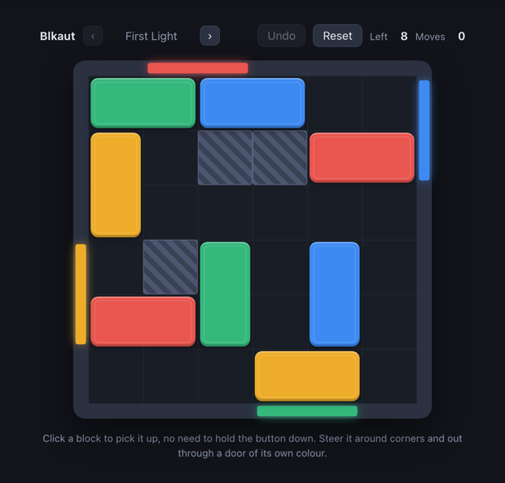

# Blkaut

A colour-sort block puzzle for the browser. The board is packed with coloured blocks and the walls carry coloured doors. Pick a block up, steer it through the free squares, and push it out through a door of its own colour. Clear every block to finish the level.

Open `app/index.html` directly in a browser. There is no build step and no dependency. The arrows in the header move between levels, as do the left and right arrow keys, and finishing one offers the next. Cmd/Ctrl-Z undoes the last move.

## Carrying a block

Clicking a block attaches it to the pointer and it stays attached until you put it down, whether or not you keep the button held; clicking again drops it, and Escape returns it to where you picked it up. Press-drag-release works too, for anyone whose hand does that anyway.

While carried, the block trails the pointer square by square. It can only turn where it is lined up with the grid, so it edges to the next grid line before changing axis, which is what lets one gesture run along a row, down a column and out through a door without stopping. One gesture is one move, however many corners it turns. A door takes the block as soon as it crosses the wall by a pixel, so leaving never needs a deliberate shove.

## How a move is judged

A block moves one cell at a time. Each cell it lands on must be empty ground, or must cross the wall the block is heading for through a door of the block's own colour. Corners are never a way out, and a door only passes a block whose whole leading edge fits inside it, so a two-cell-wide block will not fit a one-cell door. Leaving is atomic: a block never rests half off the board.

## What is here

| File | Contents |
|---|---|
| `app/index.html` | The page: HUD, board, win overlay. |
| `app/style.css` | Board, blocks, doors, and the fixed-width HUD slots. |
| `app/rules.js` | The whole game model. Legality, sliding, and exits, with no DOM. |
| `app/game.js` | Rendering, carrying, undo, and reset. Asks `rules.js` what is legal. |
| `app/levels/level-NN.js` | One level each: board size, walls, doors, blocks, and its par. |
| `app/levels/level-NN.solution.txt` | Solver output for that level, replayed by the tests. |
| `tools/blkaut.py` | The level model for the tools: both solvers, careless playouts, measurements. |
| `tools/verify-level.py` | Solves one level and describes it. |
| `tools/generate-levels.py` | Shakes out candidate levels, measures them, keeps a varied set, draws a preview sheet. |
| `tools/adopt-level.py` | Turns a candidate into a real level and registers it. |
| `tools/sync-levels.py` | Rewrites the three lists of levels from what is in `app/levels/`. |
| `tools/replay-test.js` | Checks every level's data, replays its solution through `rules.js`, and checks how doors refuse a block. |
| `tools/drag-test.html` | Drives the real page with synthetic pointer events, up to a full playthrough. |
| `tools/tools-test.py` | Smoke test for the level tools, which the game's own tests never touch. |
| `Makefile` | Runs the test passes. |
| `.github/workflows/pages.yml` | Publishes `app/` to GitHub Pages on every push to `main`. |

Everything the site serves is under `app/`, and nothing else is: the tools, the tests and this README stay out of what gets published. The deploy runs from Actions, so a fork needs its Pages source set to GitHub Actions rather than to a branch.

## Working on it

Run the tests with `make test`, or one pass at a time with `make test-rules`, `make test-tools` and `make test-drag`.

Playing needs nothing but a browser; the tests need three things. `node` runs the rules pass. [uv](https://docs.astral.sh/uv/) runs the level tools, and fetches the Python 3.11 they ask for if you have none. Chrome or Chromium drives the real page for the drag pass: `make` looks in the usual places on macOS and Linux, and set `CHROME` to a browser somewhere else. A missing browser fails the pass rather than skipping it, so a green run means all three passes ran.

### Making levels

    tools/generate-levels.py --count 10 --tries 600 --preview sheet.html
    tools/adopt-level.py candidates.json --pick 1 --name Logjam

The generator packs random boards, throws away the ones that will not play, and keeps a set whose measurements sit as far apart as possible. Adopting one writes the level and its solution and registers it everywhere; `sync-levels.py` alone rebuilds those lists if you write a level by hand.

After editing a level, `verify-level.py app/levels/<level>.js --update` re-solves it and writes the new par and solution file back, so the two cannot drift apart.

### Two solvers, for two questions

`solve_fast` answers "does this work, and roughly how long is it". It is greedy and it searches a reduced set of moves: only the squares a block comes to rest on, having run out of room. That misses solutions that need a block parked in open space, which is why it is for screening, where a wrong answer costs one candidate out of hundreds.

`solve_exact` proves the shortest solution and is the default for a level being kept. Its cost is set by how much room the blocks have, not by board size or block count: a crowded seven-square board proves in seconds, while an open one of the same size can outrun any patience. Tighten a level that will not finish. `GAVE UP` means the search hit its cap and is not the same answer as `UNSOLVABLE`.

### Reading a level's measurements

Move count is one number among several and on its own says little about whether a level is any good. `verify-level.py` prints the others:

- **careless** — how often random play, biased toward taking any exit going, clears the board. This is the closest thing to a difficulty reading: a level that careless play always clears asks nothing of the player, and one it never clears has to be planned.
- **density** — how much of the board is occupied. What actually creates ordering: with blocks free to round corners, anything with a clear path walks straight out, so an open board plays itself however many blocks it holds.
- **shuffles** — moves beyond one per block, so how many blocks have to be moved twice. Fewer one-gesture-per-block solutions makes a harder level, and `--min-shuffles` biases the generator toward them. Screening reports this from the greedy solution, so it is an upper bound: a candidate showing several may prove to have none. Read it as how much a hurried player is made to double back, and treat the filter as a bias rather than a guarantee.
- **branching** — how many moves are available, averaged over the opening. Room to think in.
- **openings** — blocks that can leave from their starting square.

Levels are not meant to climb in difficulty. A set wants variety across all of these, which is what the generator selects for.

## Constraints

- **Legality lives in `rules.js` and nowhere else.** `game.js` may position things and animate them, but it must never decide for itself whether a move is allowed; the tests and the browser have to be judging the same game.
- **A move in the solver is a move in the game.** The search counts gestures because the player makes gestures. Changing what one gesture can do means changing the search to match, or the level's recorded minimum starts measuring a game nobody is playing.
- **Blocks are rendered as rectangles.** The model handles any set of cells, but a block is drawn as one bounding box, so a level with an L-shaped piece would draw wrongly.
- **The page is a fixed width, wider than any board.** Boards are centred in it and the header spans it, so neither a bigger board nor a longer level name shifts the header when you switch level. A board wider than that width would break the arrangement.

## License

MIT. The full text is in [LICENSE](LICENSE).
